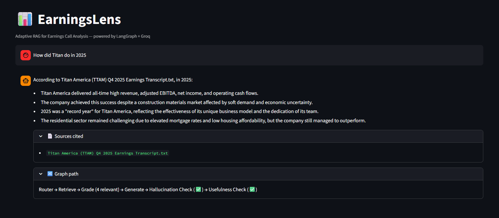

# 📊 EarningsLens — Adaptive RAG for Earnings Call Analysis

🔗 **[Live Demo — v1 (Streamlit Cloud)](https://earningslens-b4fjpwzptyqempqmzuhuff.streamlit.app/)**
🔗 **[Live Demo — v2 (Docker + Railway)](https://earningslens-production.up.railway.app/)**



An intelligent Q&A system that lets you ask questions about earnings call transcripts and SEC filings and get grounded, cited answers. Built with **LangGraph** for agentic self-correcting retrieval.

Unlike basic RAG (retrieve → generate), EarningsLens uses an **Adaptive RAG** architecture that verifies its own answers and self-corrects when retrieval or generation fails.

---

## 🆕 v2 — What Changed

| | v1 | v2 |
|--|----|----|
| Vector store | ChromaDB (local disk) | Pinecone (cloud) |
| Deployment | Streamlit Cloud | Docker + Railway |
| Observability | None | Query logging (latency, grounding, route) |
| Infrastructure | Local venv | Containerised |

---

## 🏗️ Architecture

```
User Question
     │
     ▼
┌──────────┐    general question    ┌───────────────┐
│  Router   │ ─────────────────────▶│ Direct Answer  │──▶ END
└─────┬─────┘                       └───────────────┘
      │ compare query
      ▼
┌──────────────┐
│ Compare Mode  │──▶ Retrieve per company ──▶ Side-by-side Answer ──▶ END
└──────────────┘
      │ needs retrieval
      ▼
┌──────────┐
│ Retrieve  │ ◄─────────────────────────────────────────┐
└─────┬─────┘                                           │
      ▼                                                 │
┌──────────┐   no relevant docs   ┌──────────────┐     │
│  Grade    │ ───────────────────▶│ Rewrite Query │─────┘
│ Documents │                     └──────────────┘
└─────┬─────┘
      │ relevant docs found
      ▼
┌──────────┐
│ Generate  │
│  Answer   │
└─────┬─────┘
      ▼
┌──────────┐   hallucination detected   ┌──────────────┐
│  Check    │ ─────────────────────────▶│ Rewrite Query │──▶ Retrieve (loop)
│ Grounded  │                           └──────────────┘
└─────┬─────┘
      │ grounded ✅
      ▼
┌──────────┐   not useful   ┌──────────────┐
│  Check    │ ─────────────▶│ Rewrite Query │──▶ Retrieve (loop)
│ Useful    │               └──────────────┘
└─────┬─────┘
      │ useful ✅
      ▼
  Final Answer (with source citations)
```

**Why this matters:** In financial analysis, hallucinated numbers or misattributed quotes are dangerous. The self-correcting loop ensures answers are both grounded in source documents and actually useful.

---

## 🚀 Quick Start

### Option A — Docker (v2, recommended)

```bash
# Clone the repo
git clone https://github.com/abhaythomas/earningslens.git
cd earningslens

# Configure API keys
cp .env.example .env
# Edit .env and add your GROQ_API_KEY and PINECONE_API_KEY

# Build and run
docker compose up --build
```

Open **http://localhost:8501**

### Option B — Local Python (v1)

#### Prerequisites
- Python 3.10+
- A [Groq API key](https://console.groq.com) (free)

```bash
# Clone and set up
git clone https://github.com/abhaythomas/earningslens.git
cd earningslens

python -m venv venv
source venv/bin/activate  # Windows: venv\Scripts\activate

pip install -r requirements.txt

cp .env.example .env
# Edit .env and add your GROQ_API_KEY

# Ingest documents then launch
python ingest.py
streamlit run app.py
```

---

### Add Data

Drop documents into the `data/` folder — the ingestion pipeline handles both formats automatically.

| Format | Source | Example |
|--------|--------|---------|
| `.txt` | Earnings call transcripts | Motley Fool, Seeking Alpha |
| `.pdf` | SEC filings (10-Q, 10-K) | Company IR pages, SEC EDGAR |

Free sources:
- [The Motley Fool - Earnings Call Transcripts](https://www.fool.com/earnings-call-transcripts/)
- [Seeking Alpha](https://seekingalpha.com/earnings/earnings-call-transcripts)
- [SEC EDGAR Full-Text Search](https://efts.sec.gov/LATEST/search-index?forms=10-Q)

---

## 🛠️ Tech Stack

| Component | Technology | Why |
|-----------|-----------|-----|
| Orchestration | **LangGraph** | Graph-based agentic workflows with conditional routing |
| LLM | **Groq (Llama 3.3 70B)** | Free, fast inference — no local GPU needed |
| Embeddings | **HuggingFace (all-MiniLM-L6-v2)** | Free, CPU-only, ~90MB model |
| Vector Store (v1) | **ChromaDB** | Local disk, zero cloud dependency |
| Vector Store (v2) | **Pinecone** | Managed cloud index, survives container restarts |
| Frontend | **Streamlit** | Chat interface with observability panel |
| Containerisation | **Docker** | Reproducible builds, cloud-deployable |
| Documents | **LangChain + pdfplumber** | Chunking, retrieval, PDF table extraction |

---

## 📁 Project Structure

```
earningslens/
├── README.md               # You are here
├── Dockerfile              # Production image (v2)
├── railway.json            # Railway deployment config
├── .env.example            # API key template
├── .gitignore
│
├── app_v2.py               # Streamlit frontend (v2) — Pinecone + observability
├── graph_v2.py             # LangGraph workflow (v2)
├── nodes_v2.py             # Node functions (v2) — Pinecone vector store
├── ingest_v2.py            # Ingestion pipeline (v2) — uploads to Pinecone
├── requirements_v2.txt     # Python dependencies (v2)
│
├── app.py                  # Streamlit frontend (v1) — ChromaDB
├── graph.py                # LangGraph workflow (v1)
├── nodes.py                # Node functions (v1) — local ChromaDB
├── ingest.py               # Ingestion pipeline (v1) — local disk
├── requirements.txt        # Python dependencies (v1)
│
└── data/                   # Drop .txt transcripts and .pdf filings here
    └── README.md
```

---

## 💡 Key Design Decisions

**Adaptive RAG over basic RAG:** A naive retrieve-then-generate pipeline has no way to know when it fails. The graph-based approach adds three verification layers (document relevance, hallucination, usefulness) and self-corrects by rewriting the query and retrying — up to 3 attempts.

**Pinecone for cloud deployment:** v1 used ChromaDB on local disk — simple, but incompatible with ephemeral cloud containers. v2 migrates to Pinecone's serverless free tier so the vector index persists independently of the container. The `PineconeVectorStore` API is a drop-in replacement — all downstream nodes are unchanged.

**Docker for reproducibility:** The full dependency chain (LangChain, LangGraph, sentence-transformers, pdfplumber) is pinned and containerised. `docker compose up --build` produces an identical environment on any machine or cloud host. Torch is installed as CPU-only to keep the image lean (~2GB instead of ~8GB).

**Observability layer:** Every query is logged to `query_log.jsonl` with timestamp, latency, route taken, docs retrieved, and whether the answer was grounded. The sidebar surfaces this as live metrics (avg latency, grounding rate, total queries). In production, this data can be loaded into a monitoring dashboard.

**Groq over local models:** Groq provides access to Llama 3.3 70B for free — a much more capable model than what most consumer hardware can run. The architecture is LLM-agnostic; swap `ChatGroq` for `ChatOllama` to run fully locally.

**Separate grading and hallucination checks:** These are distinct failure modes. A document can be retrieved but irrelevant (grading catches this). An answer can use relevant documents but still hallucinate details (hallucination check catches this). Separating them gives more precise self-correction.

**pdfplumber for PDF ingestion:** Unlike basic PDF parsers, pdfplumber has table-aware extraction — it reconstructs financial tables (revenue breakdowns, balance sheets) as readable row/column strings rather than garbled text. Boilerplate pages (cover, table of contents) are automatically skipped. Each page is stored with its page number in metadata so citations are precise: `Apple_10Q.pdf (p. 4)`.

---

## 🔮 Potential Extensions

- [x] ~~Add PDF ingestion (SEC filings, annual reports)~~ ✅
- [x] ~~Multi-company comparison queries~~ ✅
- [x] ~~Migrate to cloud vector store (Pinecone)~~ ✅
- [x] ~~Containerise with Docker~~ ✅
- [x] ~~Query observability and latency tracking~~ ✅
- [ ] Time-series analysis across quarterly calls
- [ ] Financial entity extraction (revenue, EPS, guidance numbers)
- [ ] Monitoring dashboard from query log data

---

## 📜 License

MIT
